## Gestió de processos

La gestió de processos és una part fonamental en la gestió de projectes que utilitzen sistemes operatius com Ubuntu. Aquesta gestió implica supervisar, controlar i optimitzar els processos que s'executen en el sistema per garantir un funcionament eficient i evitar conflictes.

# Veure els processos del sistema

Amb la comanda pstree podem visualitzar els processos actius a l'usuari marc amb forma d'arbre.

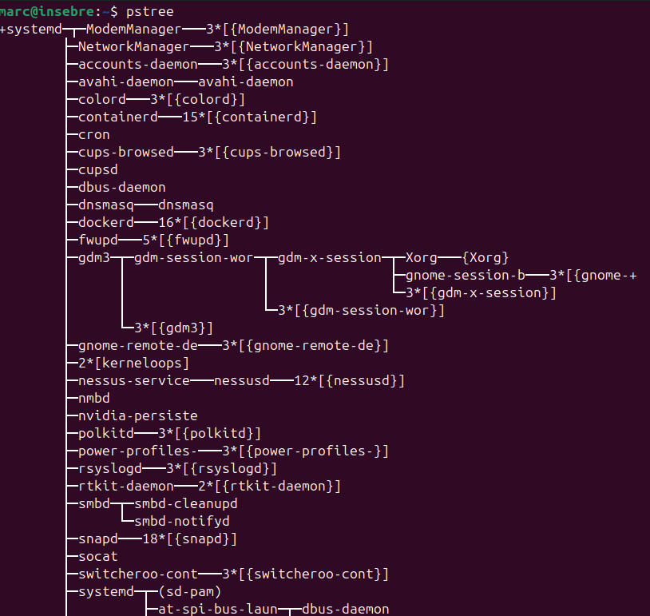

Aquest comanda consta d'una opció per filtrar els processos per usuari amb el pstree -h.

EN aquest cas joan no té cap processos obert.
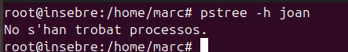

I si afegim el -p ens afegira l'identificador de cada proces.

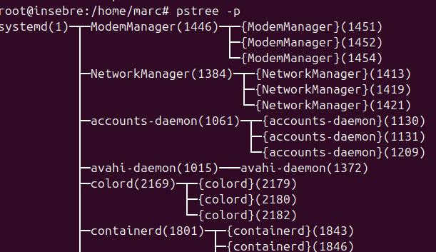

Amb l'opció  -T mostra solament el nom del proces.

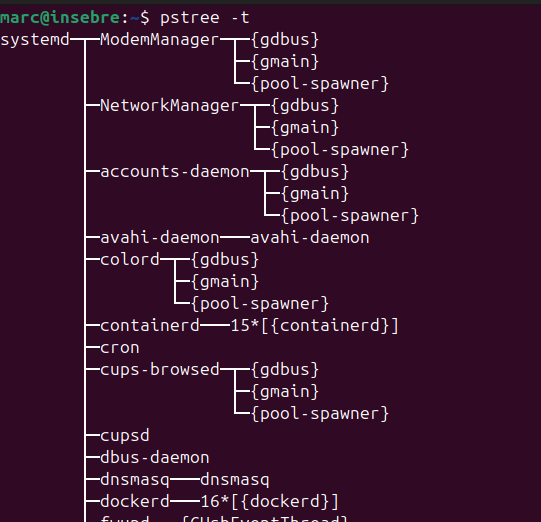

Amb el -N ens ordena la sortida del UID o identificador.

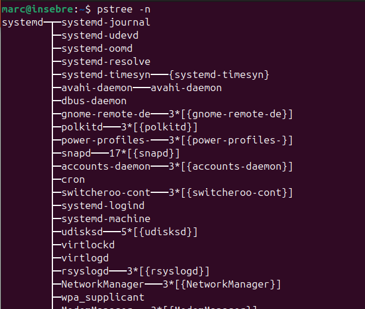

I amb el -v podem veure la versió que utilitza pstree.

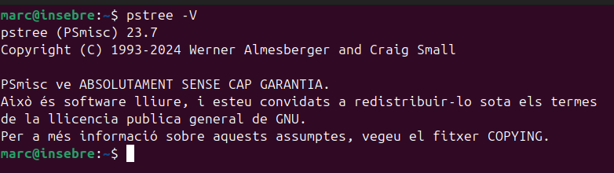

Si utilitzem el kill -9 (número de proces) matem el procés.

Si ens fixem ara he obert un altre terminal amb el número 10894 si ara faig un kill a aquest número el terminal es tancarà.

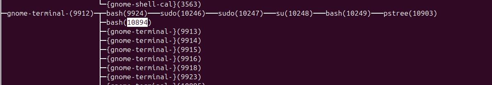

I efectivament es tanca.

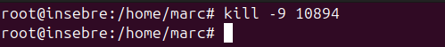

Ja no apareix l'altre terminal.

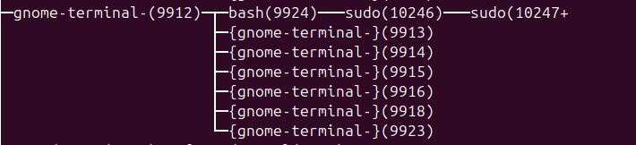

El top té una funció similar a la del pstree tot i que aquest ens determina més informació del proces com la memoria que utilitza, recursos, tot això a temps real.

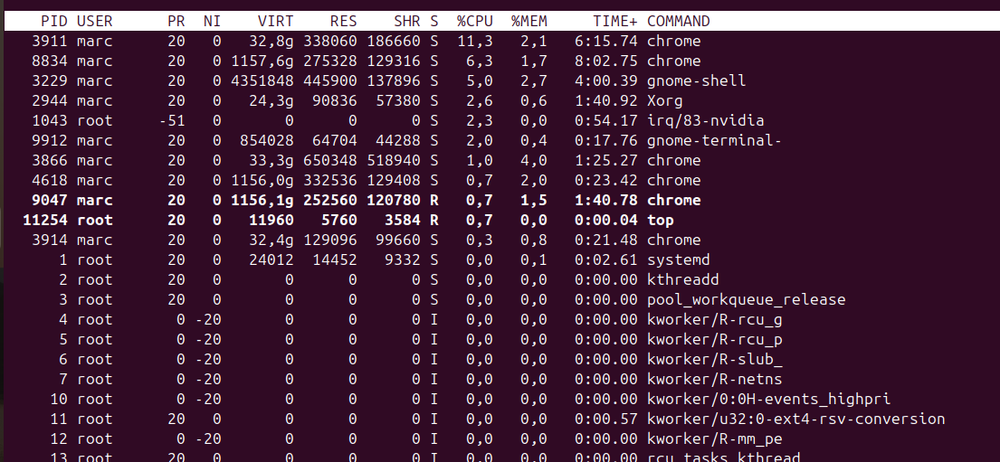

Si ens fixem la primera línia ens indica que és cada camp.

Hi han 12 camps:

PID (Process ID): És l'identificador únic de cada procés en execució al sistema. Serveix per identificar i controlar un procés específic, com ara finalitzar-lo amb la comanda kill.

USER: Mostra el nom d'usuari que té els drets sobre el procés. Aquest usuari és el responsable d'executar el procés. Permet veure quins processos estan associats amb un usuari concret i controlar l'ús de recursos per part de cada usuari.

UID (User ID): És l'identificador numèric associat a l'usuari que ha llançat el procés. El valor de UID és útil per identificar un usuari en el sistema a través del seu ID numèric en lloc del nom d'usuari.

PR (Priority): Indica la prioritat del procés. Els processos amb una prioritat més baixa es consideren més importants per al sistema. Controlar la prioritat pot ser útil per gestionar la càrrega del sistema i assignar més recursos a processos més importants o urgents.

NI (Nice value): El valor de "nice" ajusta la prioritat d'un procés. Un valor nice més baix fa que el procés sigui més prioritari, mentre que un valor més alt el fa menys prioritari. Aquest valor es pot modificar per canviar la prioritat d'un procés sense haver de finalitzar-lo.

VIRT (Virtual memory size): Indica la quantitat total de memòria virtual utilitzada pel procés. Aquesta memòria inclou la memòria RAM i la memòria que està en ús per altres recursos (com el disc dur per al paginatge). Permet controlar si un procés està utilitzant més memòria del que seria normal o desitjable.

RES (Resident memory size): Indica la quantitat de memòria física (RAM) utilitzada pel procés en un moment donat, excloent la memòria que és compartida amb altres processos. Aquesta informació és útil per identificar processos que consumeixen molta memòria RAM i que poden afectar el rendiment global del sistema.

SHR (Shared memory): Mostra la quantitat de memòria compartida que utilitza el procés, com ara biblioteques compartides amb altres processos. Permet veure l'ús de la memòria compartida, important per optimitzar l'ús de recursos entre diversos processos.

S (Status): Mostra l'estat actual del procés. Pot ser un dels següents:

R: En execució o llest per executar-se (Running).
S: Dormint (Sleeping), esperant per alguna cosa.
D: Dormint en estat de no-interrupció (Uninterruptible sleep).
T: Aturat (Stopped), per exemple, per una senyal.
Z: Mort (Zombie), el procés ha acabat però el seu pare no ha recollit la informació. Aquesta informació ajuda a identificar si els processos estan actius o si hi ha processos que podrien estar inactius o bloquejats.
%CPU: Indica el percentatge de la CPU que un procés està utilitzant en un moment donat. Aquesta mesura és important per veure quins processos estan consumint més potència de càlcul del sistema.

%MEM: Indica el percentatge de memòria RAM que un procés està utilitzant en el moment actual. Permet identificar els processos que consumeixen més memòria en el sistema, la qual cosa pot ser útil per evitar que el sistema es quedi sense recursos.

TIME+: Mostra el temps total de CPU utilitzat pel procés des que va començar a executar-se, expressat en format de temps (minuts i segons). Aquesta informació és útil per veure quant temps ha estat un procés en execució i si és necessari per al sistema.

COMMAND : Mostra el nom del procés o el comandament que s'està executant. Aquesta informació és útil per identificar clarament quin procés s'està executant i ajudar a reconèixer l'activitat que està passant al sistema.

## CTRL+C I CTRL+Z

Per cancelar un proces s'utilitza cntrl+c

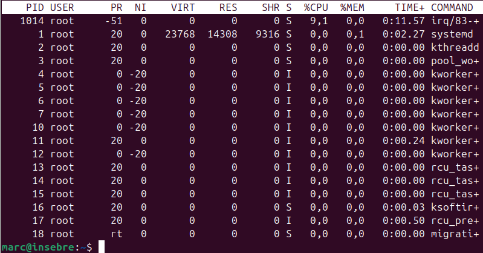

I amb cntrl+z suspen el proces executat.

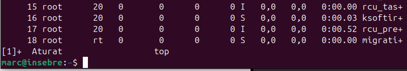
