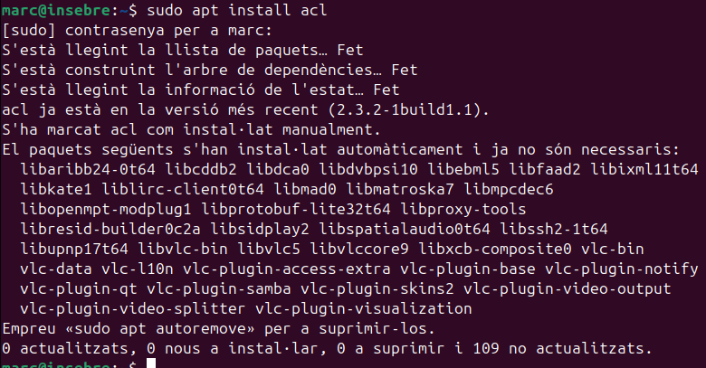
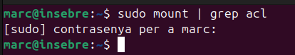
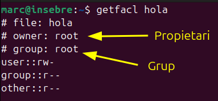
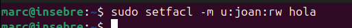
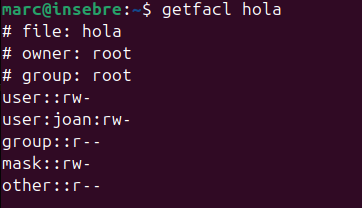
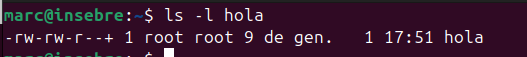
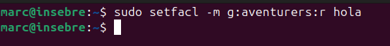
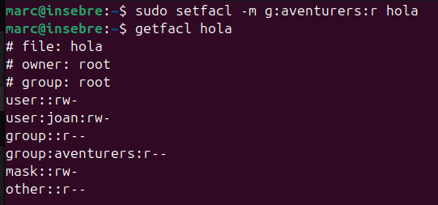
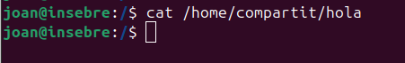

Les ACLs son un altra forma per gestionar els permisos als usuaris i grups.

Les ACLs permeten definir permisos més detallats sobre qui pot llegir, escriure o executar un arxiu, permetent especificar usuaris o grups específics, fins i tot si no són els propietaris o no formen part del grup associat a l'arxiu.

Per poder començar a uilitzar les ACLs, primer es tindran que instal·lar.

També habilitarles al sistema.

Ara ja podem utilitzar les acl.

La comanda fetfacl ens mostra els permisos que té actualment el fitxer sobre l'usuari el grup i altres.
També ens garantitza més informació com el propietari del fitxer i al grup el  cual pertany.

En aquest cas podem veure que el fitxer pertany al grup i propietari root.

Ara he fet una prova per assignarli permisos a l'usuari joan de lectura i escriptura sobre l'arxiu hola.

-m: Modifica l'ACL.
u:juan:rw: Dona permisos de lectura (r) i escriptura (w) a l'usuari juan.

I si torno comprovar s'han aplicat correctament els canvis.

Si ara faig el ls -l del arxiú hola per veure els permisos apareixera un signe de + per informar que aquest arxiú consta d'una ACL configurada.

També puc modificar per a que el un grup pugui tenir els permisos que vulgui sobre el fitxer.

Així els usuaris del grup aventurers podran veure l'arxiu hola.

I com podem veure l'usuari ja té accés al arxiu hola.

