A continuació explicare algunes comandes bàsiques importants a la terminal d'Ubuntu

### Instal·lació programa

### Instal·lació Urban Terror

Primer he instal·lat el repositori

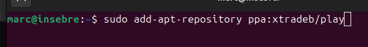

I finalment l'instalare

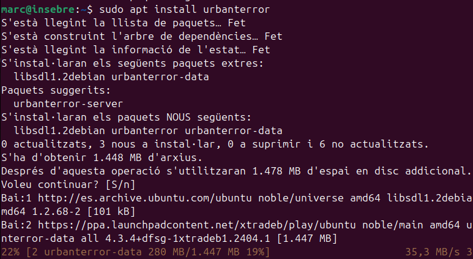

I ja el tindre instal·lat.

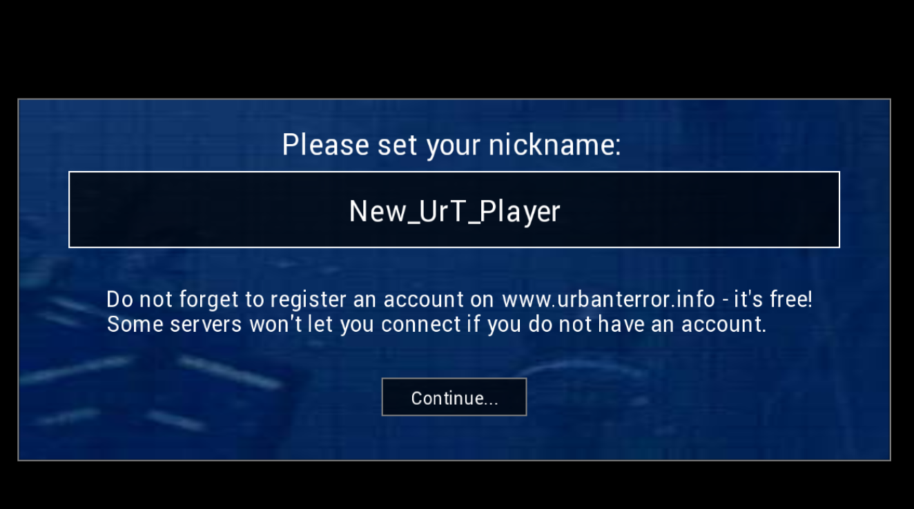

***sudo apt install***

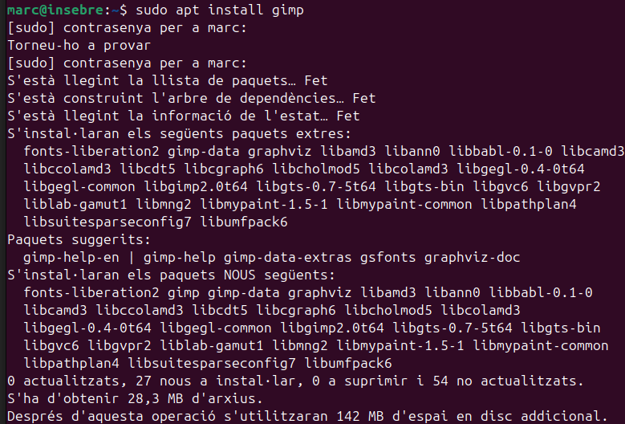

Aquest és un programari de disseny gràfic lliure i de codi obert. Permet editar imatges de manera professional, amb funcionalitats que inclouen retoc fotogràfic, composició d'imatges, creació d'animacions i dibuix digital.

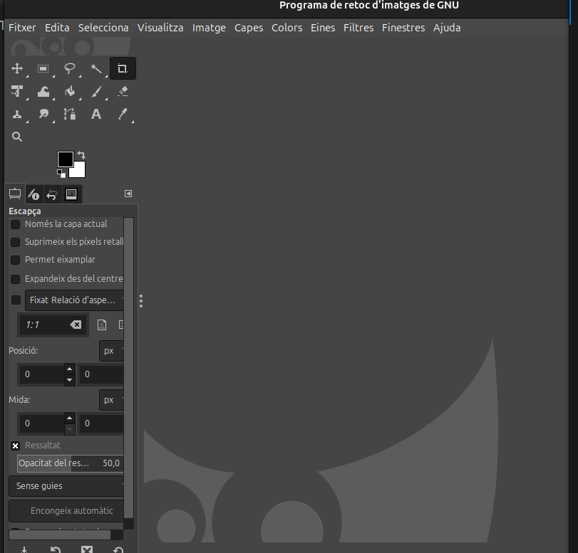

Aquest té moltes opcions desde la selecció, pinzells, relleno, corrector de color com el contraste, saturació etc.

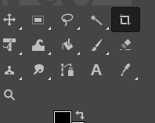

Actualtzar tots els arxius a la última versió.

***updgrade***

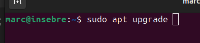

També podem llistar la versio del programari que hi ha disponible amb apt list -a

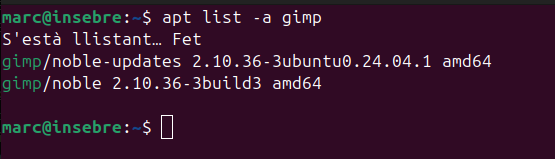

***aptitude***
Aptitude ens dona molta més informació sobre les coses que estem instal"lant per exemple aquí ens mostra els paquets que instal·larem si prenem enter.

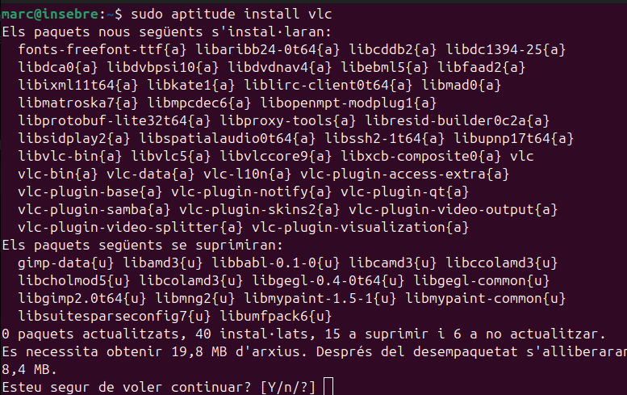

***Descomprimir archiu .deb***

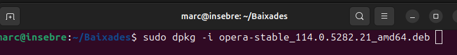

I ens crea la capeta on dins estan els arxius.

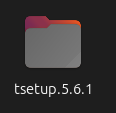

***Descomprimir archiu tar.xz***

Per descomprimir un arxiu tar.xz utrilitzarem aquesta comanda.

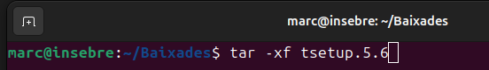

***Borrar archiu***

Per borrar una carpeta utilitzare rm amb l'atribut -r que indica que té que borrar tot el contingut més la carpeta.

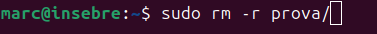

***Mostrar archius directori***

S'utilitza la comanda ls 

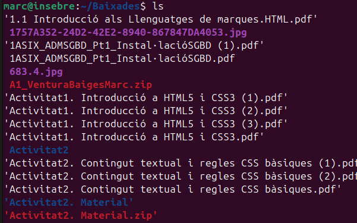

Sortir de la carpeta.

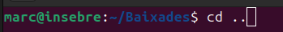

Mostrar contingut arxiu, és molt util per si solament volem visualitzar per exemple una configuració sense tocar res.

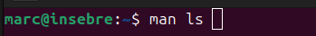

Moure arxiu 
Podem moure arxius a altres carpetes.

Podem eliminar una aplicació pero mantenint els arxius de configuració amb el remove 

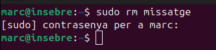

I per eliminar l'aplicació i tots els arxius de configuració s'utilitza el purge.

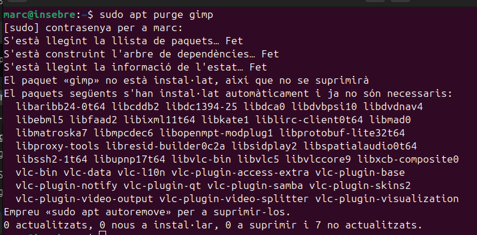

