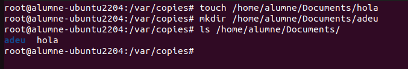
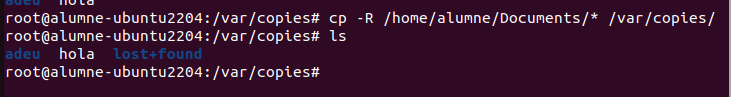
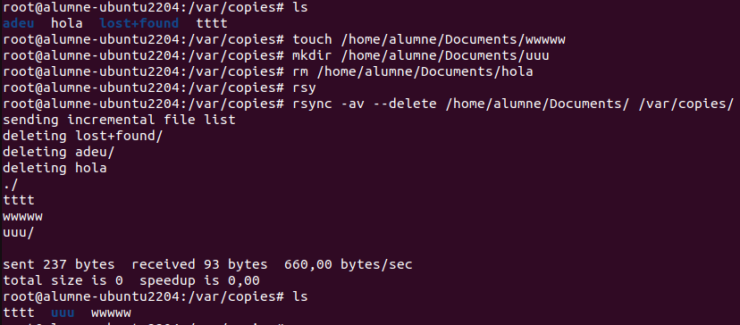
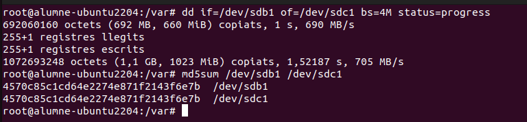

En aquest apartat explicare algunes de les maneres optimes per fer copies de seguretat a Ubuntu Desktop.
També l'automatització de tasques etc.

Explicare la configuració de copies de seguretat amb 3 opcions molt bones.

 CP  En el context de còpies de seguretat, el cp es pot fer servir per crear còpies de seguretat manuals dels arxius o directoris importants d'un sistema, duplicant-los en una altra ubicació, com un disc dur extern o una carpeta de seguretat.

Fare l'exemple dins del directori /home/alumne/Documents on he creat un fitxer i una carpeta,

La comanda cp ens permet copiar contingut d'una carpeta, arxius o directoris d'una manera molt sencilla.

Com puc comprovar a la foto he copiat tot el contingut de la ruta /home/alumne/Documents/* al directori /var/copies.

I si faig un ls puc veure com s'han copiat correctament.

RSYNC

Rsync és una eina per copiar i sincronitzar fitxers i carpetes, i és molt útil per fer còpies de seguretat. La seva gran avantatge és que, en comptes de copiar tot el fitxer de nou, només copia el que ha canviat, així que és més ràpid i estalvia espai.

En aquesta captura he seguit el mateix procediment, aquest és una copia clara d'automatitzacio d'una tasca ja que com puc comprovar creo un fitxer i una carpeta i amb el rsync elimino el contingut anteriorment creat a la carpeta i el copio al directori /var/copies, a més a més rsync ens informa dels canvis fets

 
 DD a diferència d'altres eines, dd treballa a un nivell molt baix, copiant blocs de dades sense preocupar-se pel sistema de fitxers, el que la fa ideal per a tasques com fer còpies de seguretat completes d'un disc dur o crear imatges exactes d'un dispositiu d'emmagatzematge.

 En aquest exemple copio les dades del sdb1 al sdc1, si després faig un md5sum dels dos discs puc veure que el hash és el mateix, normalment amb discos amb gran quantitat de dades el hash canvia, en aquest cas no ja que sol tenim un arxiu i una carpeta.

 
