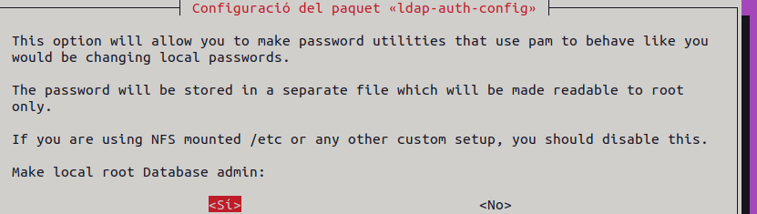
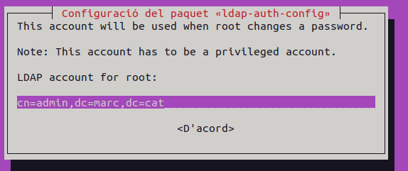
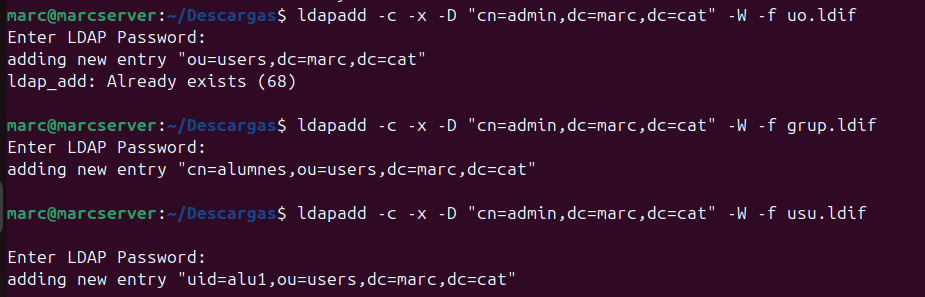
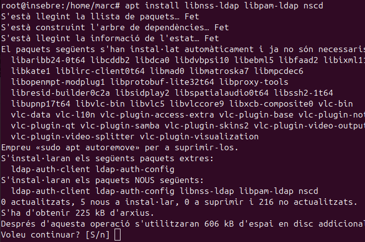
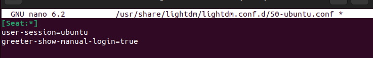
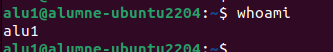
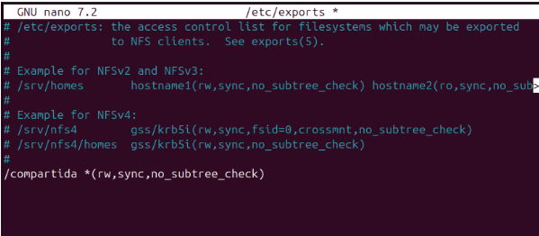
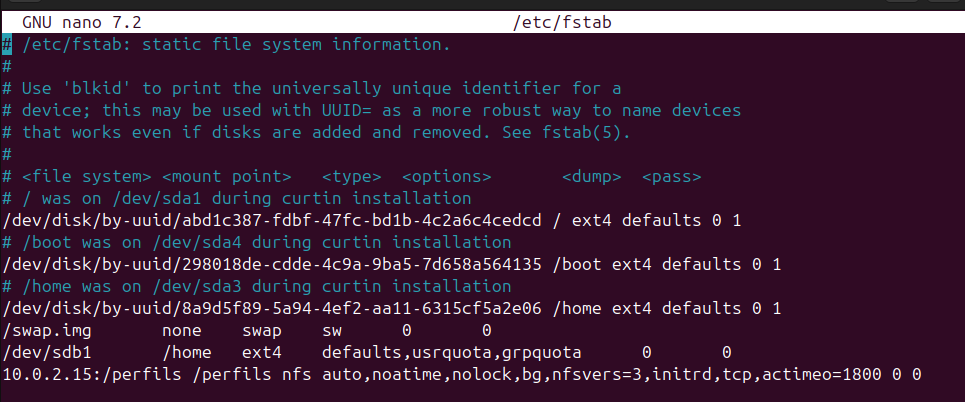

## Instal·lació ldap al servidor

En primer lloc he instal·lat el servidor ldap i ldap-utils per configurar el servidor.

Un cop instal·lat configurare el servidor ldap amb les credencials que jo vulgui.

Un cop dins ens demana si volem guardar o eliminar lo configuració que hi ha actualment direm que sí.

Ara configurare el que s'anomena el name of the LDAP search per tant el nom del domini , que en el meu cas és marc.cat.

També ens demana la versió, selecciono la 3.

Posem el root com a admin de la base de dades.

Compte de root.

Ara li assigno una contrasenya.

I finalment el tipus d'encriptació per la contrasenya.

Ara si faig un slapcat puc comprovar que s'ha aplicat la configuració al servidor.

## Creació usuaris al servidor

Dins del fitxer usu.ldif puc crear un nou usuari en el meu cas he creat l'usuari alu1 on li he creat el directori /home/alu1.

També he creat una nova unitat organitzativa amb el nom users dins del fitxer uo.ldif.

I finalment un nou grup anomenat alumnes on afagirem com a membre a alu1, tot això al fitxer grup.ldif.

Ara ja tinc els fitxers configurats per crear els objectes que necessito, em queda anyadir-los amb la comanda ldapadd.

## Unir client al domini

Un cop tinc el server actiu i ben configurat hi puc fer la prova per unir un client en aquest domini.

Jo he iniciat una nova màquina Ubuntu Desktop que fara com a client i s'unira al servidor ldap.

Un cop dins ens demana la configuració on posare ldap:// i la IP del servidor que és 10.0.2.15.

També he d'afegir la línia de gshadow al fitxer nsswitch.conf.

També he d'afegir la línia session optional

També afegire aquesta línia.

Ara si faig un getent passwd puc comprovar que tinc l'usuari al client, per tant estic connectat.

Per tant puc accedir a l'usuari.

## SERVIDOR NFS

Pimer instl·lare el servidor nfs al Ubuntu, amb aquesta comanda.

També l'instl·lació per la part del Ubuntu client.

I per al client Windows.

Seguidament anire a activar o desactivar característiques de Windows.

I finalment activare el servei nfs per al client.

Ara creo una carpeta anomenada compartida i li dono els permisos adients.

Ara al arxiu exports afegeixo aquesta línia 

Si ara faig la prova amb el windows puc comprovar que efectivament esta compartida cal recordar que tene que estar al mateix rang de xarxa.

Sí ara creo una carpeta desde el Windows la tinc que poder visualitzar al servidor.

Efectivament apareix al servidor.

## Perfils Mobils 

Ara crearem un altra carpeta i li pasarem la ruta al arxiu /rtc/exports.

Li assignarem per al usuari alu2 el directori de la carpeta que hem creat.

Li indiquem aquesta línia.

Apartir d'aquí ja no vaig poder accedir a alu2.