El particionatge a Ubuntu és una etapa fonamental en la instal·lació del sistema operatiu, ja que permet dividir l'espai de disc en unitats lògiques anomenades particions. Aquest procés facilita la gestió dels recursos del sistema, millorant el rendiment i la seguretat. A més, el particionatge permet tenir diferents sistemes operatius o gestionar de manera independent les dades d'usuari, els fitxers del sistema i els fitxers temporals. Ubuntu ofereix eines gràfiques i de línia de comandes per realitzar aquest particionatge, amb opcions com ext4 o LVM per a una major flexibilitat.

Per fer una prova de particionatge a un disc he creat una màquina virtual amb un disc secundari de 2GB per crear una partició de 1GB.

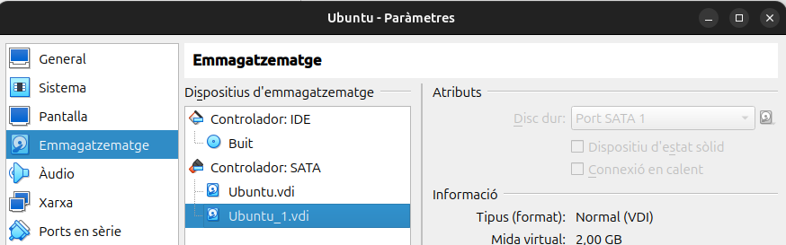

Un cop dins la màquina podem visualitzar els discs amb la comananda fdisk -l.

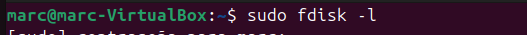

Aquí tinc el disc i com puc comprovar no tinc cap partició.

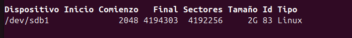

## Particio al disc

El primer que fare és crea una partició al disc sdb de 1GB on tindre compartida una carpeta.

Ens sortira aquest menú i si prenem la tecla M ens sortiran totes les opcions que podem utilitzar, per tant jo utilitzare la lletra n per crear una nova partició.
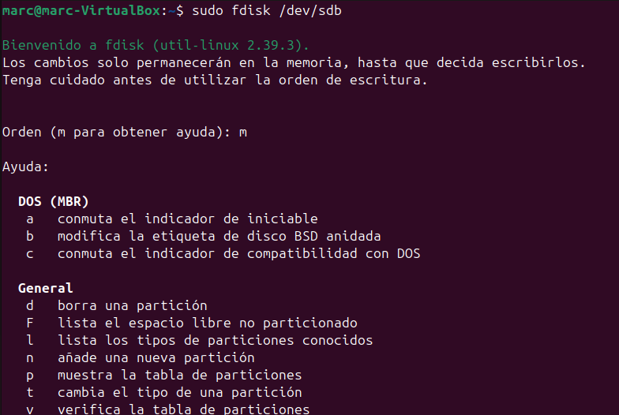

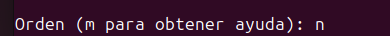

Ara ens preguntara el tipus de particio que volem crear seleccionem primaria, el número de particio que el deixem en predeterminat i el tamany de la particio que poso 2000000 que equivaldrien a 976,6 MiB finalement per desar els canvia posarem la lletra w (write)

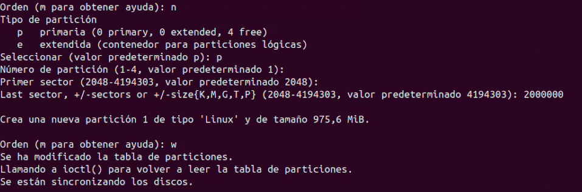

Ara si he creat correctament la partició si torno a executar fdisk -l apareixera el disc juntament amb la partició.

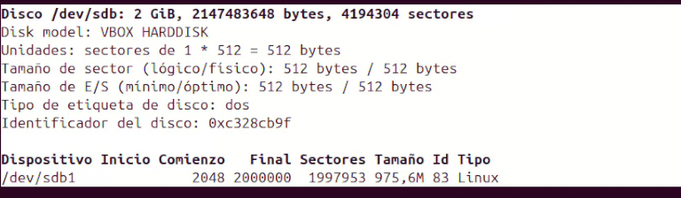

A continuació he creat el sistema de fitxer a la partició exactament de 2048 Bytes

Aquesta partició le configurat per sistema de fitxers ext4 per tant és exclusivament per sistemes Linux.

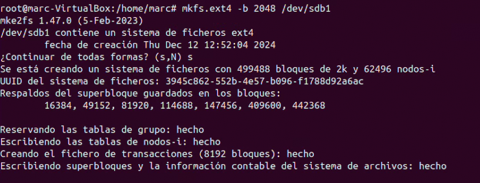

Ara podem comprovar si s'ha aplicat correctament la configuració de la partició amb aquesta comanda.

I efectivament ens surt la mida del bloc que li he assignat.

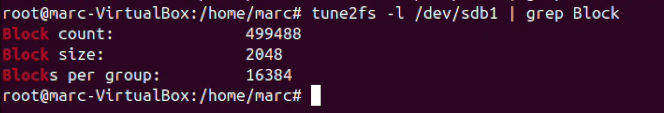

A la part dreta té que apareixer la partició de 1GB.

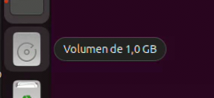

I com encara no he creat res dins de la partició apareixera buida.

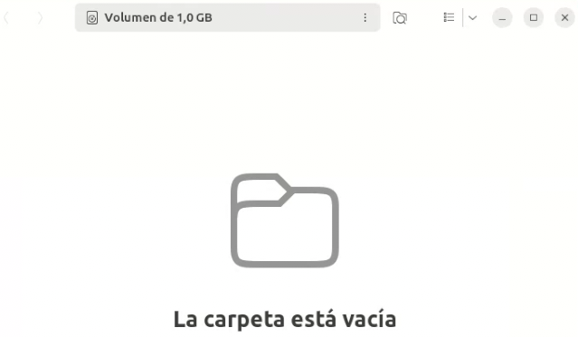

Com he dit anteriorment ara vull assignar una carpeta per aquesta partició.

Per primer he de crear una carpeta al directori /var.

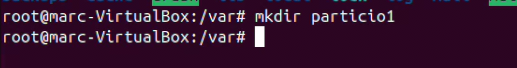

I un arxiu.

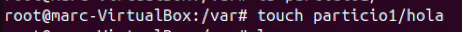

Ara sí, faig el mount de la partició a la carpeta que he creat al directori /var amb format de fitxers ext4.

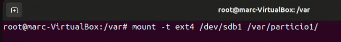

Si ara visualitzo el que tinc a la carpeta particio1 puc veure el lost+found, que és la carpeta que es crea de manera predeterminada al monta la carpeta a una partició.

Per tant l'arxiu hola ja no esta a la particio nova.

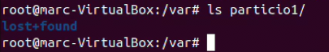

Pero si ara torno a crear un altre arxiu sí que apareixera a la partició

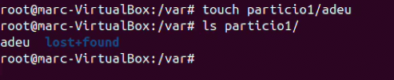

Per tant ara si faig el df -T puc veure que la particio està a la carpeta corresponent.

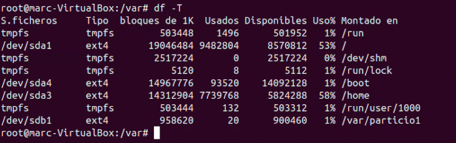

Amb el mount cada cop que reiniciem el sistema la partició es desmonatara, i de vegades no ens interessa per tant si volem mantenir els canvis tindriem que modificar el fitxer /etc/fstab auqesta és la configuració que equival al mount.

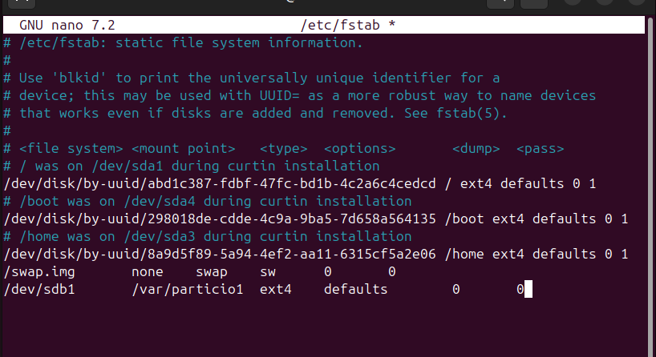

## Accés amb samba

Samba és una eina que permet que un sistema Linux/Unix funcioni com un servidor de fitxers o de recursos compartits per a ordinadors Windows i altres dispositius compatibles amb SMB. Això inclou:

Compartició de fitxers:

Comparteix carpetes i fitxers entre ordinadors Linux i Windows.

Els usuaris poden accedir als fitxers com si fossin locals, amb permisos configurables.

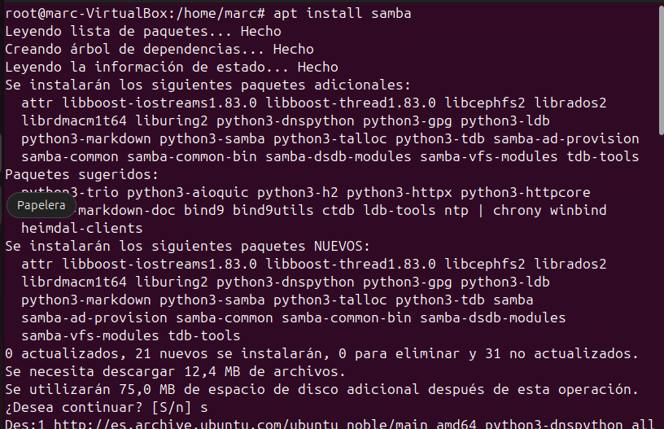

Ara fare la prova per accedir a la particio i la carpeta que he creat anteriorment.

Desde el client.

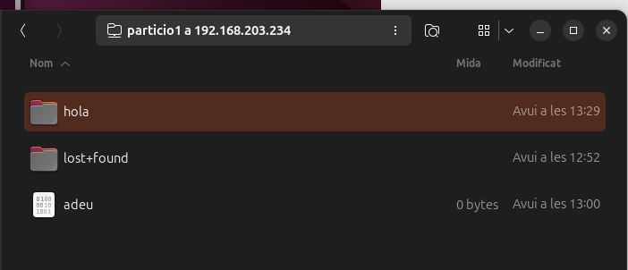

## Paticio NTFS per Windows

Ara fare el mateix procediment pero amb format de fitxer NTFS per tenir accés a la partició desde un sistema operatiu Windows.

Afegire un nou disc i creare de nou una partició.

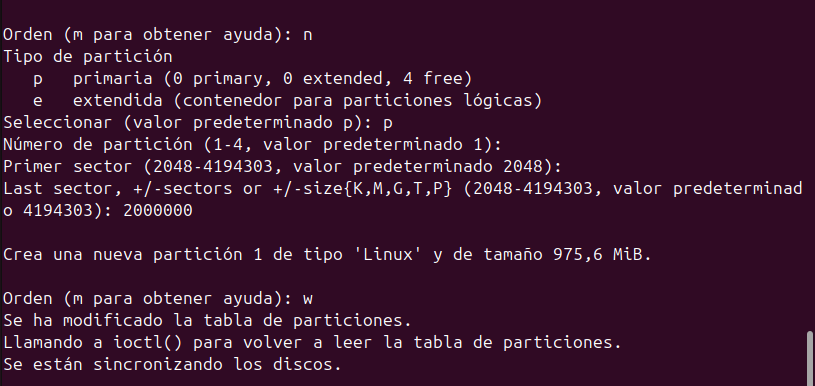

Un cop creada la particio instal·lare el sistema de fitxers NTFS a la màquina. 

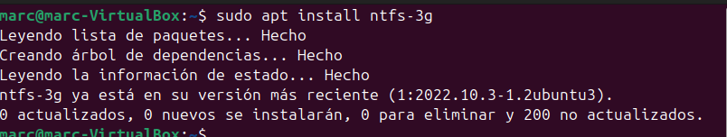

Ara formateijo la partició sdb1 creada.

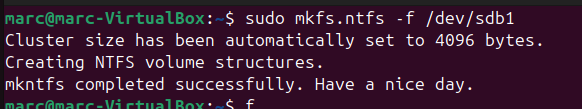

Ara creo la carpeta compartida per la partició al directori /var.

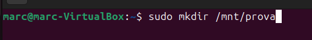

I munto la partició a la carpeta corresponent.

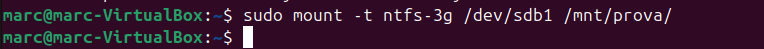

I si faig un lsblk puc veure que la partició esta a la carpeta corresponent.

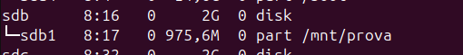

Ara ja tant sols em queda configurar l'arxiu smb.conf amb la ruta de la carpeta.

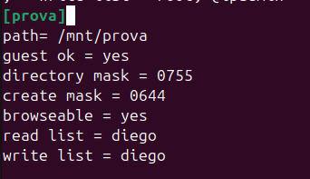

I d'aquesta manera ja podriem accedir a la carpeta prova de la partició /dev/sdb1.

