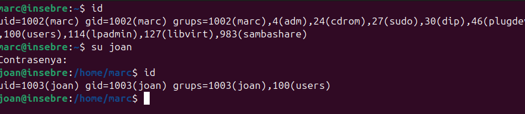
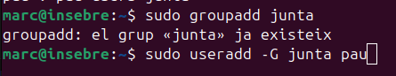

##  Arxiu /etc/group
 
En aquest fitxer podem visualitzar tots els grups del sistema el GUID identificador del grup i els usuaris que hi perteneixen.
                                                                        
## Tipus de permisos

I tenim 3 principals lletres les quals ens informen de quins permisos i té un usuari, un grup o altres.

| **Permís** | **Arxiu**                                     | **Directori**                                |
|------------|-----------------------------------------------|---------------------------------------------|
| r          | Permís de lectura del contingut de l'arxiu    | Permís de llistar les entrades del directori |
| w          | Permís de modificar el contingut de l'arxiu   | Permís de modificar les entrades del directori |
| x          | Permís d'executar l'arxiu                     | Permís d'accés a les entrades del directori |

Els permisos r i x han d’estar actius per accedir a l'arxiu.

Amb la comanda ls -l, podem veure els permisos del meu usuari per cada fitxer o directori.

També podem administrar els permísos especialment amb un permís determinat.

Com podem veure en aquesta taula.

| Comandament           | Propietari | Grup  | Altres | Descripció                                         |
|-----------------------|------------|-------|--------|---------------------------------------------------|
| `chmod u+r fitxer`     | r          | -     | -      | Afegir permís de lectura al propietari             |
| `chmod u-w fitxer`     | -          | -     | -      | Treure permís d'escriptura al propietari           |
| `chmod u+x fitxer`     | x          | -     | -      | Afegir permís d'execució al propietari             |
| `chmod g+r fitxer`     | -          | r     | -      | Afegir permís de lectura al grup                   |
| `chmod o+x fitxer`     | -          | -     | x      | Afegir permís d'execució a altres usuaris          |
| `chmod o= fitxer`      | -          | -     | -      | Eliminar tots els permisos a altres usuaris        |

Al primer arxiu que en  aquest cas és una foto podem veure que per l'usuari tinc el permís de llegir (r), escriure (w) pero no el d'execució, el mateix per al grup i per als altres sol consta el permís de lectura.

Aquí podem veure quin és el l'usuari i el grup.

## Administració Grups

Ara fare la prova de crear un nou usari anomenat joan.

I ara intentare crear un arxiu amb l'usuari nou.

Com podem comprovar no ens deixa, això és degut a que l'usuari no pertany al grup sudoers per tant no podra crear cap arxiu (Sempre que afegim un nou usuari ens creara l'usuari i el seu propi directori). 

Si faig un id del meu usuari principal de la màquina podem veure que pertany al grup del seu usuari marc, al de adm, al de sudo i al de users, en canvi el nou usuari joan solament forma part del seu propi grup  joan i al de users.

## Gestio de permisos i grups 

Per crear un exemple, he creat un usuari anomenat Pau aquest formara part del grup junta i tindra accès a la carpeta junta

Ara creo el grup i afegeixo a pau al grup.

Ara creo un directori prova que sol podran veure el root i els membres del grup basquet.

Ara li donem permís de la carpeta al grup junta.

I finalment li dono els permisos de llegir i escriure.

I ara ja podre accedir del usuari a la carpeta.

Ara si comprovo per entrar amb un usuari que no pertany al grup junta no podra accedir.

## Administració de contrasenyes

A Linux hi ha un fitxer que ens proporciona les contrasenyes xifrades aquest fitxer és el /etc/shadow.

No obstant aquest fitxer només l'administrador té el permís de lectura. Per tant la resta d'usuaris no el podram veure,
tot i que els usuaris poden cambiar les seves contrasenyes amb la comanda passwd.