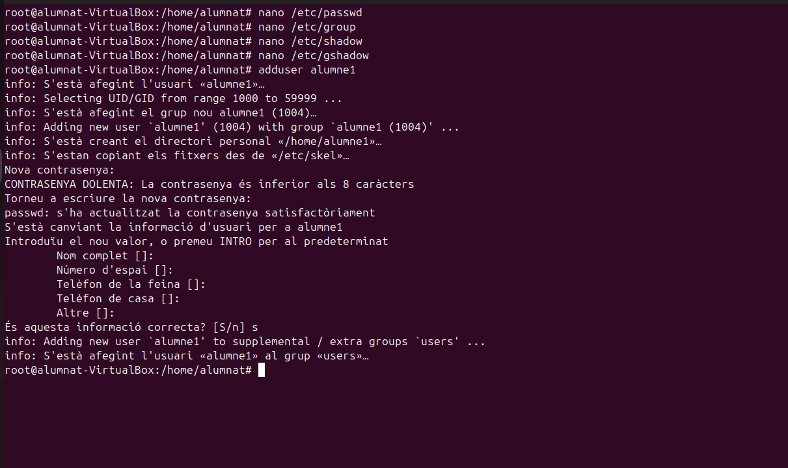
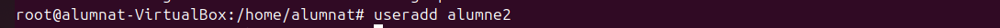
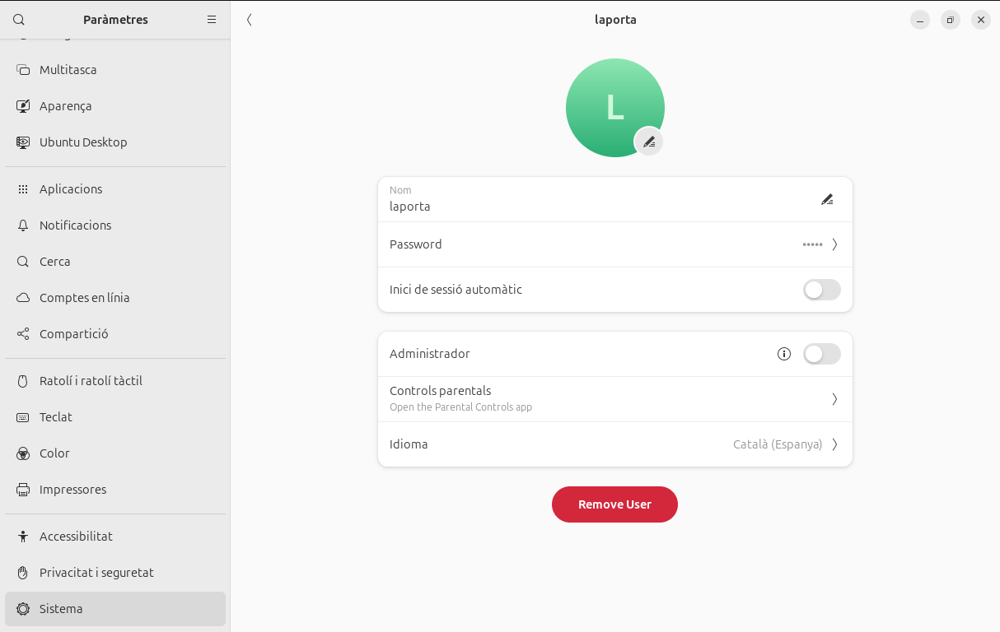
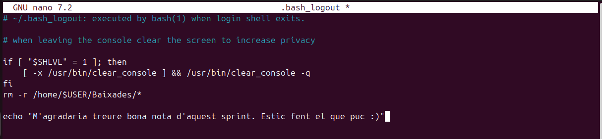
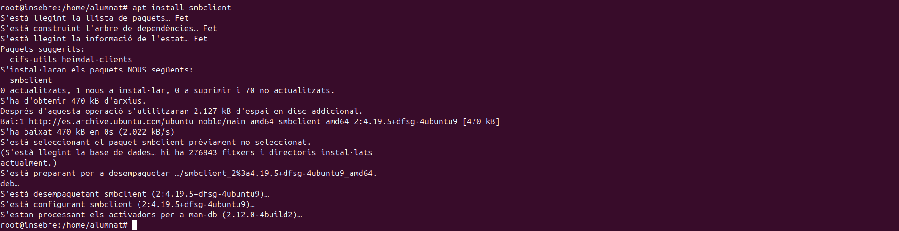
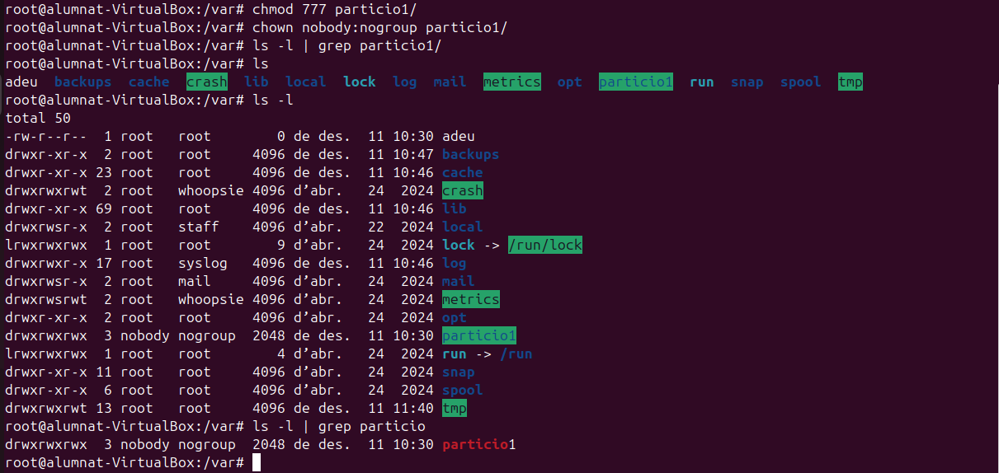
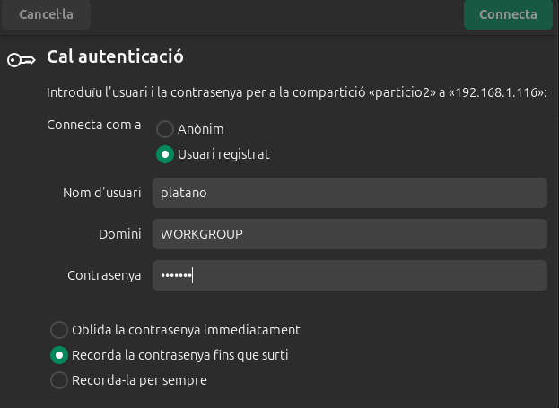
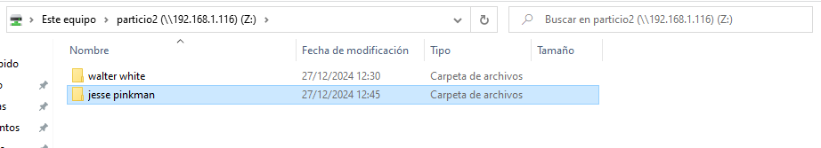
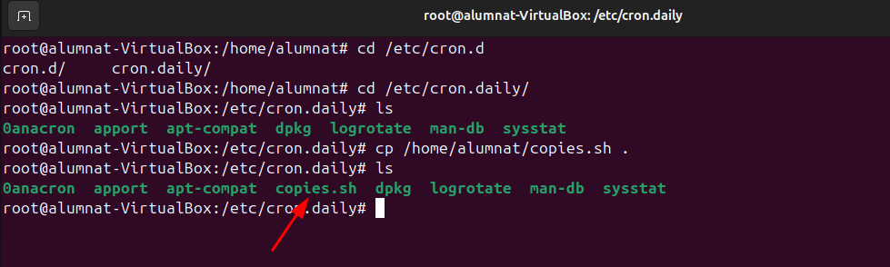
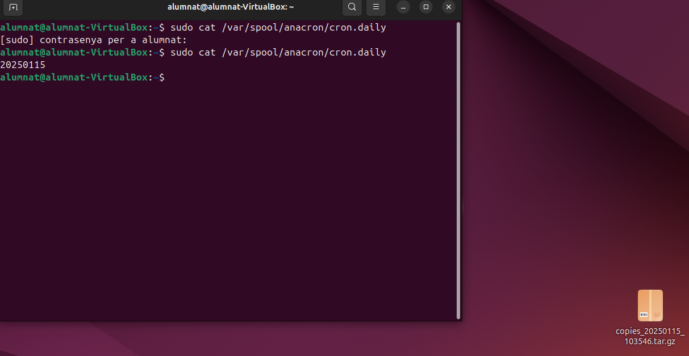

Sprint2

 

Introducció
-----------

En aquest sprint veurem com es gestionen els usuaris, grups i permisos d'un sistema en Linux. També configurarem les polítiques de seguretat per a comptes d'usuaris i per al sistema. Instal·larem i configurarem serveis i processos essencials del sistema operatiu, crearem i administrarem sistesmes de fitxers i noces particions. Implementarem un sistema de còpies de seguretat i per últim farem proves per comprovar el funcionament del sistema.

Gestió de processos
===================

*   En primer lloc definirem un procés. Aquest es un programa en execució que inclou dins seu: el seu codi, els recursos que te assignats i la seva execució. El procesos de linux poden ser en primer o en segon pla. Els que estàn en primer pla implequen una interacció amb l'usuari mentre que als de segon pla no es requereix aquesta interacció.
*   La primera comada que utilitzarem per llistar els procesos es "pstree", aquesta ens mostrarà els processos actius que hi ha i quins son els seus fills si es que en té, tot això amb forma d'arbre, d'aquí el nom.
    
    `pstree`
    
     
    
*   Amb la mateixa comanda si volem saber a l'usuari que correspon i a quin número de procés tenim ho podem realitzar amb les lletres h (usuari) i p (procés).
    
    `pstree -p -h usuari`
    
    
*   A continuació veurem com matar un procés, per això serà necessari saber quin número de procés li correspon a cadascun d'aquestos. En el cas de matar un procés pare tots els processos fills haurien de morir, tot i que hi ha una possibiltat de que algún quedi viu, i aquestos s'anomenen zombies.
*   Per matar un procés utilitzarem la seguent comanda i el número de procés:
    
    `kill -9 (PID)`
    
*   Per fer la prova he utilitzat un altre terminal i m'he guardat el seu PID, per matar el procés tal i com es demostra a continuació: 
 
 

*   La comanda anterior fa una imatge dels processos, aquestos no canvien en temps real, per fer una consulta d'aquest tipus utilitzarem la comanda "top".
    
    `top`
    
*   Aquesta comanda ens dona molta informació per columnes, i ara veurem que vol dir cada columna. PID: Identificador únic del procés. USER: Usuari que inicia el procés. %CPU: Percentatge d'ús del processador. %MEM: Percentatge d'ús de la memòria RAM. COMMAND: Nom de la comanda o programa. 
*   En cas d'obrir un nou procés (ex: navegador) aquest ens apareixerà. 

*   La prioritat no es pot modificar directament, però amb el NI (nice) si que es pot canviar, contra mes baix es el número més prioritat té. Això es pot fer amb la següent comanda. Val a dir que caldria fer-ho des de el root ja que com sabem ens otorga més privilegis.

`renice -n -nºprioritat -p PID`

 
 - Aquesta comanda serveix per moments determinats la prioritat per renice no es permanent. - Seguidament també podem utilitzar la comanda "ps aux" que ens dona una informació similar però amb diferents parametres que veurem a continuació: USER: Usuari que ha iniciat el procés. PID: Identificador únic del procés. %CPU i %MEM: Percentatge de CPU i memòria RAM utilitzats pel procés. VSZ: Memòria virtual total utilitzada pel procés. RSS: Memòria física utilitzada pel procés. TTY: Terminal associat al procés ( ? si no en te). STAT: Estat del procés. R Executant-se (Running). S = Inactiu. T = Pausat. Z = Procés zombi. I = Inactiu o sense consumir recursos. < = Alta prioritat de CPU. s = Líder de sessió. l = Multithread. + = Associat al terminal en primer pla.

`ps aux`

 - Amb el ps podem fer varies combinacions per mostrar informació en concret a continuació veurem quines són i que fan.

`ps -e`

\- Mostra tots els procesos del sistema amb una sintaxis estandar.

`ps -ejH`

\- Mostra un arbre de procesos-

`ps -eLf`

\- Mostra la informació dels fils (threads).

`ps -eM`

\- Mostra informació de seguretat

`ps -U`

\- Mostra tots els processos de root.

*   A continuació veurem que són els processos amb segon pla i com passar processos a aquest estat. Com hem dit abans amb el kill -9 matem un procés i amb el ctrl+c l'aturem i amb el ctrl+z si que el passariem a segon pla. (Nota: segons el tipus de procés que aturem, si aquest va per terminal igaul no se'ns mostra en segon pla).
*   La comada per veure els processos en segon pla es la següent.
    
    `jobs`
    
    
*   Un cop tenim aquest procés localitzat i no volem matar-lo sino que el volem enviar al primer pla podem utilitzar la següent comanda.
    
    `fg %nº` 
    
     
     
    
*   En cas de voler fer el procés invers i enviar un procés al segon pla podem utilitzar:
    
    `bg %nº`
    
*   En algun cas espacial igual volderm executar algun procés directament amb segon pla, i es pot fer de la seguent forma.
    
    `nomproces &`
    
*   A l'hora de consultar processos amb top em vist que es una eina en viu i que els processos que volem consultar es van movent i, a vegades se'ns pot fer complicat llegir-lo. En cas de voler evitar això i sol consultar el PID d'un procés en concret podem fer servir la següent comanda.
    
    `pgrep nomproces`
    
    
*   Un altra forma de fer-ho podria ser utilitzant comandes anteriors i afegir un grep, pero en algunes opcions com el ps aux pot quedar una mica confós, personalment ho recomano amb el pstree ja que així veurem també els processos fills.
    
    `pstree | grep nomproces`
    
    
*   Per acabar, si en algun moment volem utilitzar algún script o procés i que aquest tingui una prioritat predeterminada per nosaltres es pot fer amb el nice.
    
    `nice -n nºprioritat nomproces`
    
    
*   Amb un "top" podem comprovar si ha funcionat correctament. 

Gestió d'usuaris grups i permisos
=================================

*   Es important que al nostres sistema tinguem diferents usuaris i que aquestos tinguen diferents caracteristiques, i que els puguem incloure en grups per classificar-los. A més a més, també ens interessarà poder modificar-los, eliminar-los i bloquejar-los al nostre gust. Tot això i més ho veurem a continuació.

\- Commandes terminal i accessos als directoris
-----------------------------------------------

Per a accedir al terminal normalment ho faremt amb un crtl + alt + t, així obrim el pseudo terminal. El terminal com a tal l'obrirem al el ctrl dret + F3, aquest es un terminal TTY. Un pseudo terminal es com un emulador on les comandes que posem son interpretades per algún arxiu al que fan referencia i aquest fa els procediments, en canvi amb un terminal si que estem amb contacte directe amb el sistema.

*   En primer lloc veurem un document que actua com un registre de tots els comptes d'usuaris presents al sistema. Inclou dades com el nom del compte, l'identificador d'usuari (UID), el directori personal i el shell configurat per defecte. Es tracta d'un fitxer públic, cosa que permet que qualsevol pugui consultar qui són els usuaris del sistema.
    
    `nano /etc/passwd`
    
    
*   A continuació podem veure els grups dels usuaris i l'identificador de qui es el seu administrador.
    
    `nano /etc/group`
    
    
*   A continuació, en aquest arxiu es guarda la informació relacionada amb les contrasenyes dels comptes d'usuari. Cada registre fa referència a un usuari i inclou la seva contrasenya codificada. Si apareix el símbol "!", això indica que el compte està deshabilitat i l'usuari no té permís per accedir al sistema.
    
    `nano /etc/shadow`
    
    
*   Per últim aquest arxiu és comparable a /etc/group, però ofereix detalls extres sobre els grups. En aquest lloc es pot identificar qui són els administradors de cada grup. Resulta pràctic per controlar els permisos i gestionar els privilegis d'accés dels diferents grups d'usuaris.
    
    `nano /etc/gshadow`
    
    

\- Creació d'usuaris
--------------------

Per crear usuaris tenim diverses formes de fer-ho, el més important es tenir clar que amb certes comandes no es creen directoris sol usuaris. A continuació es mostrarà com crear usuaris.

*   En primer lloc utilitzarem la següent comanda, aquesta ens creara un usuari pero fins que no fessim un log in amb aquest no ens crearà els directoris. Aquesta es la forma més senzilla de crear els usuaris ja que et ve pautada pel propi sistema operatiu.
    
    `adduser usuari`
    
     Per crear un nou compte d'usuari al sistema, farem servir la comanda useradd. Aquesta comanda ens permetrà afegir usuaris al sistema amb diversos paràmetres que ens ajuden a configurar les seves propietats. A continuació, detallem alguns dels paràmetres més destacats que podem utilitzar:
    
*   \-m: Indica que es generarà automàticament un directori personal per a l'usuari.
    
*   \-s /bin/bash: Aquest paràmetre ens permet definir el shell per defecte de l'usuari.
    
*   \-d /home/alumne2: Amb aquest paràmetre, especifiquem el directori inicial de l'usuari. Per exemple, en aquest cas, el directori personal serà /home/alumne2.
    
*   alumne2: Correspon al nom de l'usuari que estem creant. En aquest exemple, l'usuari es dirà "alumne2".
    
*   && passwd alumne2: Aquesta comanda s’utilitza per assignar o modificar la contrasenya de l’usuari "alumne".
    

`useradd usuari`

 - Sino utilitzem la comanda -m per als directoris els podem afegir de la següetn manera.

`mkdir usuari`

 

*   Si volem canviar el nom de l'usuari podem utilitzar la següent comanda. EN el cas que hi ha a continuació volem canviar el nom d'usuari de porva2, ja que hauria de ser prova2.

`usermod -l usernou user`

  

*   En cas de voler eliminar accés a un usari ho podem fer bloquejant-lo, la comanda seria la següent. Una forma de comprovar que s'ha bloquejat correctament es entrar a la carpeta de passwd i veurem que la contrasenya del usuari al davant té un signe d'exclamació "!"

`usermod -L usuari`

  - Seguint amb la creació d'usuaris, si tenim un usuari bloquejat i el volem recuperar utilitzarem aquesta comanda. A l'hora de comprovar-ho ens fixarem que ja no te l'exclamació.

`usermod -U usuari`

 - Si realment el que volem es eliminar l'usuari de forma més permanent ho farem amb la següent comanda. Per comprovar si l'hem eliminat correctament podem entrar a la carpeta passwd i veurem que l'usuari ja no hi es.

`deluser usuari`

 

*   Per complementar una mica les comandes que tenim, aquí en tenim algunes que ens poden ajudar també, la següent elimina la "home" de l'usuari.
    
    `rm -r usuari`
    
*   Un dels problemes habituals es que no eliminem les homes i directoris dels usuaris, amb la següent comanda ho podem fer tot a la vegada.
    
    `userdel -r usuari`
    
*   En cas de voler consultar algun tipus d'informació sobre algun usuari, podem fer-ho així.
    
    `id usuari`
    
    
*   Un cop vist com es el funcionament a través del terminal podrem observar com es fa per l'interficie gràfica d'Ubuntu. Dins de la configuració de sistema hem d'entrar a l'apartat usuaris, i després seguirem els passos que hi ha a continuació.     

\- Creació de grups
-------------------

*   En aquest apartat veurem com funcionen els grups d'usuaris, com hem vist anteriorment podem consultar els grups i les seves contrasenyes. Important dir que quan es crea un usuari també es crea un grup amb el nom d'aquest.
*   Per crear un grup nou ho podem fer amb una senzilla comanda.
    
    `addgroup grup`
    
     
    
*   D'altra banda si el que volem es afegir un usuari a un grup existent ho podem fer d'aquesta manera.
    
    `adduser usuari grup`
    
     
    
*   L'operació anterior també es pot fer amb aquesta comanda.
    
    `gpasswd -a usuari grup`
    
*   Per fer a un usuari administrador d'aquell grup ho podem fer així. Dins de la carpeta gshadow podem veure els usuaris i administradors dels grups, per reconeixels veurem la posició que tenen entre els ":", l'alumne 2 es administrador d'asix1 i membre d'asix2.
    
    `gpasswd -A usuari grup`
    
     
    
*   Un dels majors problemes es que quan afegim usuaris a grups amb les comandes anteriors els treu del grup on estaven, per evitar-ho hem d'utilitzar la següent comanda. Com comprovarem l'usuari alumne2 forma part dels dos grups d'asix i es administrador del primer.
    
    `usermod -a -G grup usuari` 
    
     
    
*   Per eliminar un usuari d'un grup ho farem com veurem a continuació. En aquest cas l'alumne2 ja te prous responsabilitats i l'eliminarem del grup d'asix1.
    
    `gpasswd -d usuari grup`
    
     
    
*   L'anterior comanda també es pot fer amb aquesta altra
    
    `deluser usuari grup`
    
    
    
*   Per fer un usuari el principal d'un grup en concret utilitzarem el següent.
    
    `usermod -g grup usuari`
    
*   En cas de voler canviar el nom d'algun grup ho farem amb la següent comanda.
    
    `groupmod -n grupnou grupvell`
    
     

\- Configuració de fitxers d'usuari
-----------------------------------

*   Com hem vist tenim una serie de comandes per defecte que tenen una serie d'efectes sobre els usuaris que hem creat. Tot això es pot canviar, la seva útilitat resideix en que si volem que els nostres usuaris nous tinguin diferents directoris o inclús politiques de contrasenyes diferents. Ara veurem com es modifiquen els següents arxius.
*   El primer arixu que modificarem es el `/etc/default/useradd` que ens permet establir els valors predefinits per als nous usuaris, com la ruta del directori personal i el shell per defecte. Per configurar-lo utilitzem la següent comanda.
    
    `nano /etc/default/useradd`
    
    Els parametres que es poden modificar son els següents:
*   GROUP: Especifica el grup que s'assignarà com a grup principal per defecte als nous usuaris. Si està comentat o no existeix, el sistema crea un grup nou per a cada nou usuari amb el mateix nom que l'usuari.
*   HOME: Defineix la ruta base per als directoris de casa dels nous usuaris. Per defecte, és /home. Si vols canviar la ubicació dels directoris de casa, pots modificar aquest paràmetre.
*   INACTIVE: Estableix el nombre de dies després dels quals una contrasenya expirada passarà a estar inactiu si no es canvia. Un valor de -1 desactiva aquesta funcionalitat.
*   EXPIRE: Data en què l'usuari expira, en format AAAAMMDD. Si està comentat o no s'especifica, l'usuari no expira mai.
*   SHELL: Indica el shell per defecte per als nous usuaris. El valor predeterminat és /bin/sh, però es pot canviar a /bin/bash o qualsevol altre shell disponible.
*   SKEL: Especifica el directori des del qual es copiaran els fitxers de configuració per defecte quan es creï un nou usuari. El valor predeterminat és /etc/skel.
*   CREATE\_MAIL\_SPOOL: Si està establert a "yes", es crearà una carpeta de correu per a l'usuari nou. Per defecte, està establert a "yes". 
*   Aquestes son unes possibles modificacions (d'exemple) 
    
*   Un altre fitxer que podem modificar es el de la politica de contrasenyes que es aquest `/etc/login.defs`
    
    `nano /etc/login.defs`
    
    Els parametres que ens permet modificar son:
    
*   MAIL\_DIR: Defineix l'ubicació del directori d'emmagatzematge de correu per als nous usuaris. Per defecte, és /var/mail.
*   PASS\_MAX\_DAYS: Nombre màxim de dies que una contrasenya pot ser vàlida. Per defecte, pot ser 99999, el que significa que no expira mai.
*   PASS\_MIN\_DAYS: Nombre mínim de dies entre canvis de contrasenya. Per defecte, és 0, el que permet canvis immediats.
*   PASS\_MIN\_LEN: Longitud mínima de la contrasenya; no obstant això, en sistemes moderns, aquest paràmetre pot no tenir efecte, ja que la complexitat de la contrasenya es gestiona amb PAM (Pluggable Authentication Modules).
*   PASS\_WARN\_AGE: Nombre de dies abans de l'expiració de la contrasenya que es notifica a l'usuari. Per defecte, és 7.
*   UID\_MIN i UID\_MAX: Rangs mínim i màxim per als identificadors d'usuari (UID) per als nous usuaris. Això ajuda a assegurar que no es creïn usuaris amb UID que podrien entrar en conflicte amb comptes del sistema o altres usuaris.
*   GID\_MIN i GID\_MAX: Rangs mínim i màxim per als identificadors de grup (GID) per als nous grups.
*   CREATE\_HOME: Si està establert a "yes", es crea el directori de casa de l'usuari quan es crea un nou compte; si no, no es crea. Per defecte, pot ser "no" en alguns sistemes per raons de seguretat o per configuracions específiques.
*   ENCRYPT\_METHOD: Mètode de xifrat utilitzat per a les contrasenyes. Pot ser SHA512 o altres mètodes segons la versió del sistema.
*   UMASK: Defineix el valor per defecte de la màscara de permisos per als fitxers creats pels usuaris, afectant els permisos per defecte dels fitxers i directoris.
*   USERGROUPS\_ENAB: Si està establert a "yes", quan un usuari es suprimeix, el seu grup principal també es suprimeix si no hi ha altres membres en aquest grup.

 - Possibles modificacions (d'exemple) 

Per últim veurem el directori `/etc/skel`, dins d'aquest directori trobarem uns fitxers que son `.bashrc` `.profile` i `.bash_logout`. Aquestos fitxers són scripts de configuració per al shell Bash i Sh que permeten personalitzar l'entorn de l'usuari.

*   Quan es crea un nou usuari amb un directori home, el contingut d'aquest directori /etc/skel es copia al nou directori home de l'usuari. Això permet configurar arxius i directoris per defecte per a tots els nous usuaris.

`.bashrc`:

Aquest arxiu s'executa cada vegada que es crea un nou shell interactiu que no és un shell de login (per exemple, quan obres una nova finestra de terminal). Es pot utilitzar per:

*   Definir variables d'entorn: Per a variables que no necessiten ser establertes en el context de login.
    
*   Ajustar alias: Crear atacs ràpids per a comandaments llargs o freqüents.
    
*   Configurar funcions de shell: Afegir funcions personalitzades per facilitar tasques rutinàries.
    
*   Personalitzar el prompt: Canviar l'aparença del prompt del terminal.
    
*   Establir paràmetres de shell: Com historial, compleció de comandaments, etc.
    
*   A continuació un exemple d'us, canviant un "alias". Farem que ll sigui equivalent a la comanda ls -l, així cada cop que posem ll s'executarà un ls -l.
    

  

`.profile`:

Aquest fitxer s’executa automàticament quan l’usuari inicia sessió. Serveix per definir variables d’entorn i aplicar altres configuracions globals. Alguns exemples d’ús són:

*   Definir variables d’entorn, com PATH.
    
*   Configurar el prompt o ajustar altres opcions del shell.
    
*   Carregar altres fitxers de configuració, com .bashrc, si existeix.
    
*   A continuació un exemple d'us, canviarem l'editor de text per defecte i farem que sigui nano, ja que es el que més utilitzo.
    

  

`.bash_logout`

Aquest fitxer s’executa de forma automàtica quan l’usuari tanca una sessió interactiva. És especialment útil per a:

*   Alliberar recursos o aturar processos temporals.
    
*   Mostrar missatges de comiat o finalització de sessió.
    
*   Executar scripts personalitzats per tasques de manteniment.
    
*   A continuació configurarem un missatge de sortida.
    

  

Gestió de permisos
==================

En els casos d'un sistema multiusuari on vulguem que diferents usuaris tinguin certs permisos però no els mateixos, és important fer una bona gestió d'aquestos. Hi han vaires maneres de gestionar-ho, i les veurem a conitnuació.

\- Permisos estandars
---------------------

*   Els permisos estandars son una serie de permisos bàsics que es poden donar a tots els usuaris i grups. Els grups poden tenir diferents permisos respecte als usuaris, una forma de comprovar això ho podem fer de la següent forma.
    
    `ls -l` 
    
    
*   En aquest cas podem observar que el primer root que apareix és de l’usuari i el segon és del grup principal. També surt la data de creació i noms de directori, però la part important és al principi. 
*   Aquí es on podem apreciar els permisos que hi han dins dels directoris. Després de la lletra d, els primers permisos són els d'usuari "rwx" en aquest cas, això vol dir que por llegir, escriure i executar, bàsicament te tots els permisos. Després els següents permisos son els de grup equivalents a les 3 lletres següents: "r-x", en aquest cas com podem veure no te permisos per escriure. I per últim tenim els ultims 3 caràcters que equivalen a altres, usuaris que no són ni usuari principal ni formen part del grup principal, en aquest cas: "r-x", la mateixa situació que abans no poden escriure però si llegir i executar. Aquest exemple es amb "root".
*   A continuació veurem com nosaltres podem agregar permisos als usuaris i grups.
    
    `chmod -R`
    
*   Opcions de fitxer/carpeta
    
    `chrgp -R`
    
*   Grup propietari fitxer/carpeta
    
    `chown - R`
    
*   Propietari fitxer/carpeta.
*   Cada lletra dels permisos te un significat associat: u = usuari, g = grup, o = others, a = all.

\- Permisos especials
---------------------

### \- Sticky

*   L'sticky es un permís d'accés per fitxers i directoris. Quan l'apliquem l'únic usuari que el pot canviar es el root. Es pot aplicar de la següent manera.
    
    `chmod +t directori`
    
    `chmod 1775 directori`
    
*   Això es molt útil en sistemes multiusuari ja que sol el root i l'usuari que ha creat cert directori poden borrar o modificar el directori, els altres sol tenen permisos de lectura o escriptura. En cas de voler eliminar l'sticky podem utilitzar la següent comanda.
    
    `chmod -t directori`
    

### \- sgid

*   sgid es un permís que esta relacionar amb els grups i principalment permet que qualsevol usuari executi l'arxiu com si fos part del grup al que pertany aquell arxiu. Per utilitzar-la podem fer el següent.  
    
    `chmod g+s`
    

### \- suid

*   suid permet que un arxiu s'executi com si fos el propietari independentment de l'usuari que l'executi. Aquest a diferencia del sgid i sticky no es pot fer un script.
    
    `chmod g+s` 
    

\- Llistes de control d'accés (ACLs)
------------------------------------

*   Una llista de control d'accés son una serie de regles que ens permeten uns accesos a sistemes de fitxers en aquest cas. Aquestes llistes ens poden donar uns accesos mes restrictius o mes permisius segons la configuarció que faci l'usuari. Per crear una ACL utilitzem la següent comanda.
    
    `setfacl`
    
    `setfacl -m user:usuari:rw- exemple.text`
    
    `setfacl -m group:grup:rwx carpeta`
    
    `setfacl -b fitxer o carpeta`
    
*   Les restriccions venen donades per les lletres com hem vist abans, utilitza la mateixa nomenclatura. Per comprovar si les restriccions s'han aplicat correctament podem utilitzar la següent comanda.
    
    `getfacl`
    
    
    
*   Si ens em equicocat a l'hora de configurar alguna ACL podem eliminar totes les excepcions. (TOTES).
    
    `setfacl -x usuari carpeta`
    

\- Umask
--------

*   Umask s'utilitza per canviar la mascara del mode de creació d'arxius, auesta determina el valor inicial dels permisos que tindran els arxius que es creein. De forma predeterminada la mascara te el valor dels bits de permís que NO s'han d'establir, per això fem l'operació de negació. Amb les seguents imatges entendrem millor la situació.

  - El que esta fetn umask es una operació coneguda com NOR, el que equivaldria a una resta convencional. - Aquestes operacions es poden realitzar amb la següent comanda, tot i que això sol funcionarà temporalment (els arxius ja creats no canvien de permisos).

`umask + nº`

\- Per a que els canvis siguin permanents tenim que modificar la umask al arxiu que tenim a la següent ruta.

`/etc/login.defs`

\- Un cop obert l'arxiu modifiquem el valor de la umask per defecte i aquest canvi si que es permantent. 

Sistemes de fitxers i particions
================================

\- Estructura de la informació
------------------------------

*   L'estructura de la informació la podem dividir en diverses parts: la física que seria el disc (sòlid o mecànic), i l'estructura lògica que pot ser (gpt o mbr). La part lògica pot ser consultada a través de commandes per la terminal tal i com es mostra a continuació:
    
    `gdisk /dev/sda`
    
    
*   Els discs estan dividits amb blocs i dins de cada bloc tenim uns sectors. El sector és la unitat mínima física on es guarden les dades i per defecte és 512 bytes, però el SO no treballa en sectors treballa en blocs. El bloc és la unitat mínima lògica on es guarden les dades per defecte. La mida del sector no es pot canviar ve definida de fàbrica, però la mida del bloc si es pot canviar. Quan formatem la partició. Per consultar les mides del sector podem utilitzar les seguents comandes.
    
    `fdisk -l`
    
     
*   Com hem vist també ens surt on es troba instalat el sistema operatiu (part resaltada de l'imatge anterior). Per seguir analitzant les mides de les particions podem utilitzar la següent comanda.
    
    `tune2fs -l /dev/sda | grep Block`
    
    
*   Seguidament si necessitem saber la informació de les particions i sistemes de fitxers que s'utilitzen podem utilitzar aquesta comanda.
    
    `df -T`
    
    
*   Les mides dels blocs segons el tipus de fitxers que es guardin ens pot donar problemes, ara veurem dos possibles problemes amb les seves respectives solucions.

### \- Fragmentació interna

La fragmentació interna és l’espai que desaprofitem dels blocs perquè no s’acaben d’emplenar. Una solució possible és canviar la mida del block reduïm la fragmentació interna, però pots fragmentar un arxiu (baixes el rendiment), busquem un equilibri. Aquesta canvi de mida per reduir l'espai del bloc ens pot servir si emmagatzemem arxius que no tinguin una mida molt gran, com podiren ser els fitxers de text. D'altra banda si volem guardar fitxers mes grans com podrien ser pel·licules o ISOs em de fer més gran la mida del bloc perqué sino fragmentarem molt els arxius. RECOMANACIÓ! buscar sempre un equilibri i emmagatzemar els tipus d'arxius diferents en particions diferents, per no barrejar "pelis amb textos".

### \- Fragmentació externa

La fragmentació externa és quan el disc fa temps que treballa i els arxius es guarden en blocs separats i no continus, això ens fa baixar el rendiment, aquesta baixada de rendiment es pot solucionar desfragmentant el disc. La desfragmentació intenta ordenar els arxius per a que no estiguin .

\- Tipus de formateig
---------------------

Hi ha tres maneres de formatar un disc i son les següents.

*   Ràpid: Aquest formateig no borra els arxius, elimina el sistema de fitxers i en cas d'haver-hi un bloc defectuos s'ignora.
    
*   Nivell mig: Aquest tampoc elimina els arxius sinó que elimina el sistema de fitxers igual que ho fa el ràpid, la diferencia es que el mig detecta i marca els sectors i/o blocs defectuosos, sense reperar-los.
    
*   Nivell baix: En aquest igual necessitem algún programa extern. I en aquest cas si es borren els arxius, es borra tot i intenta reparar els blocs defectuosos. És el més lent dels tres. Amb commandes també tal i com es mostra a continuació. Hi ha una command per mostar la cantitat de fragmentació que tenim a la partició en concret (ens recomana si em de desfragmentar o no), i després una altra per desfragmentar-lo.
    
    `e4defrag -c /dev/sda2 (consulta)`
    
    `e4defrag /dev/sda2 (desfragmentació)`
    
     
    

\- Particions
-------------

### \- Creació de particions i formateig

*   En primer lloc per entrar a un disc utilitzem la comanda:
    
    `fdisk /dev/sdb`
    
*   Aquí assignem la configuració de la partició, en aquest cas seguim amb la configuració per defecte fins al punt de la mida dels sectors, el primer (0-2048) esta reservat per al arrel?, i després assignem l'espai que vulguem. I finalment confirmem la configuració.

*   Amb la comanda de fdisk -l, mirem la configuració que em fet sigui correcte.

*   Per definir la mida del bloc que volem configurar podem utilitzar la següent comanda. Amb aquesta comanda fem la creació d'una partició amb el format d'arxius que vulguem.
    
    `mkfs.ext4 -b 2048 /dev/sdb1`
    
    
*   Per assegurar-nos de les mides podem utilitzar la següent comanda. 

### \- Muntatge

*   Dos opcions: temporal i definitiva:
    
*   Temporal: mount es temporal, un cop montem la partició els fitxers que hi havien abans no apareixen i visceversa. Per comprovar això podem seguir els següents passos crear un arxiu abans del muntatge i un després, així veurem que quan el disc esta muntat sol veiem l'arxiu que em fet mentres aquest estava muntat, en canvi l'arxiu previ sol el podrem visualitzar després de desmuntar-lo, mentres estigui muntat no el veurem. En aquest exemple fem una carpeta "particio1" i dins posem un arxiu "hola".
    

*   Al fer un ls veiem que no ens apareix l'arxiu hola sino un que es diu "lost+found".

*   Després provem de fer un arxiu nou adeu dins la partició i com veiem aquest si ens apareix al fer un ls de la carpeta.

*   Permanent: es al fitxer `/etc/fstab`

En aquest fitxer podem definir els següents parametres:

*   /dev/sdb1: És el dispositiu de bloc que es muntarà.
    
*   /home: És el punt de muntatge, el directori on es muntarà el sistema de fitxers de /dev/sdb1. En aquest cas, es munta a /home.
    
*   ext4: És el tipus de sistema de fitxers que utilitza la partició /dev/sdb1.
    
*   defaults: Són les opcions de muntatge. defaults significa que s'utilitzen les opcions estàndard de muntatge per a ext4.
    
*   0: El primer zero es refereix a l'opció dump, que indica si el sistema de fitxers ha de ser copiat amb dump (un programa de còpia de seguretat). Un valor de 0 significa que no es farà còpia de seguretat automàticament.
    
*   0: El segon zero és per a l'opció pass, que indica l'ordre en què fsck (programa de comprovació i reparació de sistemes de fitxers) ha de ser executat en el sistema de fitxers durant l'inici. Un valor de 0 significa que fsck no es farà automàticament en aquest sistema de fitxers.
    

### \- Compartició de la carpeta a través dels servidors SAMBA

#### ext4

*   El primer pas en el nostre cas es canviar a l'adaptador pont de la nostra màquina virtual.

*   Seguidament instal·lem el smb client. L'eina smbclient et permet accedir als recursos compartits d'un servidor SMB, de manera similar a un client FTP de línia de comandes. La pots utilitzar, per exemple, per carregar i descarregar fitxers cap a i des d'un recurs compartit.
    
    `apt install smbclient`
    

*   Després instal·larem el nautilus.
    
    `apt install nautilus-share`
    
*   Per comprovar si el nautilus funciona hem de seleccionar l'opció de `recursos compartits` d'un directori, el mes probable es que no funcioni.

  

*   Per continuar com aquest pas no ens ha funcionat instal·lem samba.
    
    `apt install samba`
    
    
    
*   Un cop tenim samba instal·lat accedirem a un dels seus arxius de configuració. `smb.conf`. En aquest arxiu afegirem la nostra partició i la configurarem per l'usuari "platano" tal i com es mostra a continuació.
    
    `nano /etc/samba/smb.conf`
    
    
    
*   Per acabar amb la configuració de l'arxiu i els canvis s'apliquin hem de reiniciar el sistema. 
    
*   Abans de procedir canviarem algunes opcions de permisos i propietats del grup, com es mostra a continuació. També utilitzarem el nobody nogroup, això es fa per assegurar que el servei no exposi accidentalment més del sistema del que està pensat.
    

*   Per acabar, crearem l'usuari "platano" per al qual em configurat el servidor samba.

*   A continuació, desde la nostra màquina (no virtual) visualitzarem els recursos compartits de la següent manera:

*   Per connectar-nos al servidor compartit ho farem a través del navegador de fitxers, a l'apartat d'altres ubicacions i introduriem l'ardreça corresponent.

   

*   Com es pot veure a l'imatge, he creat un directori anomenat si, per comprovar que funciona la connexió amb els dos sentits, i que desde la màquina virtual també pot veure el que ha fet platano. 

#### ntfs

*   En primer lloc consultarem l'estat del nostre disc amb la comanda `fdisk -l` per assegurar-nos de que encara tenim espai per un altra partició. 
    
*   Ens queda encara 1G per seguir, per tant, farem els mateixos passos que abans. Menys en la part del muntatge. 
    
*   Per assegurar-nos que ho hem fet correctament podem tornar a fer un `fdisk -l` 
    
*   En aquest pas es on es troba la diferencia, formatarem la partició per amb un sistema de fitxers diferent. 
    
*   Seguidament, farem els mateixos passos que a la particio1, creem un directori i dins un arixu hola. 
    
*   En aquest cas volem fer un muntatge definitiu, així que modificarem l'arxiu `fstab`. L'única diferencia serà donar-li el format NTFS. També afegirem el uid i gid amb nobody nogroup, tal i com hem fet amb l'ext4, amb la diferencia que aquí ho apliquem directament al fstab per el format d'arxiu NTFS. 
    
*   Per continuar, assignarem al fitxer de configuració de samba a l'usuario platano per a poder accedir al servidor, tal i com hem fet abans. 
    
*   Comprovem igual que hem fet abans desde el nostre client (fora de la maquina virtual) que veiem la partició creada.  
    
*   Per últim creem un directori nou per fer-li proves.  
    
*   Ara comprovarem si el nostre servidor samba també funciona amb un sistema operatiu windows, per fer-ho crearem una màquina virtual windows 10, i entrarem desde el "explorador d'archivos" a l'apartat de xarxa i ens connectarem a una nova unitat de xarxa tal i com es mostra a continuació. 
    
*   Com es pot veure he seleccionat l'opció "conectar con otras credenciales", això es per a que platano pugui entrar. 
    
*   També podem veure la carpeta de proves que hem creat abans. 
    
*   Per comprovar si el funcionament es bidireccional crearem una altra carpeta de proves.  
    

Copia de seguretat i automatització de tasques
==============================================

Teoria
------

Hi han tres tipus de copies: completes, diferencials, incrementals. Bona politica de copies, bona gestió dels tipus.

*   Completa: Sempre que es pugui fer una copia completa, (buscar teoria, ventatga principal, desaventatge principal, i quina hem de recuperar).
    
*   Diferencials: copia la diferencia de la completa, sempre de la última, es més rapida. Pero per a recuperar-la sempre fan falta tant l'última completa com l'última diferencial, ocupa menys espai.
    
*   Incremental: Copia la diferencia de la completa, després però sol copia l'anterior incremental, hauries de recuperar totes les incrementals. Menys espai, per recuperar farira falta l'última completa i totes les incrementals.
    

Programes (sol 1 opció)
-----------------------

### Deja-dup (opcional)

### Duplicity

Comandes
--------

### Explicació i taula comparativa

### cp

*   És una copia simple no intel·ligent. Copia tot sense miraments sol funciona en local.

### rsync

*   Es una copia intel·ligent sol copia els fitxers modificats, copies entre maquines utilitzant ssh.

### dd

*   No es per fer copies de fitxers / arxius, sino a nivell particions i disc, es com una clonació. Treballa a nivell local i copia tot, no es intel·ligent. També serveix per sobrescriure dades sector a sector, diferent a formatar, dona seguretat per no recuperar les dades previes, esborra tot a nivell de bloc.

Automatització amb scripts, cron i anacron
------------------------------------------

### Diferencies entre anacron i cron

Cron:

*   Funció: Automatitza tasques específiques en moments precisos (hora, dia, mes, etc.).
*   Ús: És útil quan vols que una tasca s'executi a una hora concreta, per exemple, cada dia a les 2:00 AM.
*   Limitació: Només funciona quan l'ordinador està encès; si està apagat en el moment programat, la tasca no s'executarà.

Anacron:

*   Funció: També automatitza tasques, però està dissenyat per a màquines que no estan sempre enceses.
*   Ús: Ideal per a tasques de manteniment del sistema que no depenen de l'hora exacta, com actualitzacions periòdiques. Quan engeguem l'ordinador, anacron comprova si hi ha tasques pendents i les executa.
*   Avantatge: Funciona bé en ordinadors que es tanquen sovint, ja que no es perd cap tasca programada.

Cron: Per tasques específiques per a un usuari o quan necessites precisió temporal (per exemple, backups diaris a una hora concreta).

Anacron: Per tasques generals, com manteniment del sistema que no requereixen ser executades en un moment exacte.

Configuració de cron:

*   Arxiu global: `/etc/crontab` per tasques que afecten tots els usuaris.
*   Usuari específic: Utilitza crontab -e -u usuari per configurar tasques per a un usuari particular.
*   Carpetes predeterminades: Dins de `/etc/cron.daily/`, `/etc/cron.monthly/`, i `/etc/cron.annually/` per scripts que s'executin diàriament, mensualment o anualment, respectivament.

Configuració de anacron:

*   Arxiu: `/etc/anacrontab` on es defineixen les tasques d'anacron.

### Exemple d'un script

*   Per preparar un script primer crearem els directoris que volem copiar, que es troben dins del directori Imatges.

*   En primer lloc crearem un script que crea una copia comprimida del directori /home/alumnat/Imatges/ i el desa a l'escriptori amb un nom que inclou la data i hora actuals.

*   A continuació dins del fitxer crontab, afegim la ruta del nostre script. Com es pot verue a la següent imatge li definim el minut hora i dia del mes, i amb un \* a l'apartat dels dies per a que es faci cada dia.

*   Per comprovar el seu funcionament esperem fins l'hora que em designat, com es veu a la següent imatge es crea l'arxiu comprimit, al descomprimir-lo podem veure que si ha fet la copia dels dos directoris que hi ha a la carpeta Imatges.

*   A continuació deixem la linea del crontab comentada. I seguidament del nostre escript li traurem el punt sh i el mourem a la carpeta de cron.daily.

  

*   Per assegurar que l'script s'executi al obrir l'ordinador, obrim el fitxer `/var/spool/anacron/cron.daily`, aquí s'indica l'última vegada que es van executar les tasques diàries. En aquest cas ens interessa que no hi hagui res.

*   Amb l'script al lloc de les tasques diaries i amb la comprovació de que no s'han realitzat encara obrim `/etc/anacrontab` i el configurem tal i com es mostra a continuació. Posem que s'executin en 1 minut després de l'arrencada del dispositiu.

*   Un cop reiniciat l'ordinador esperem un minut i veurem que a l'escriptori apareix la copia del directori imatges, i si mirem el cron.daily veurem que s'ha executat la tasca diaria.

 

Quotes de disc
==============

Les quotes de disc són unes limitacions imposades a l'ús d'emmagatzematge d'un sistema en aquest cas cas Ubuntu. És poden limitar tant per usuaris com per grups, això es fa per optimitzar l'espai i no fer un malbaratament d'espai. Les quotes es poden modificar en entorns de servidors o ordinadors multiusuari, i els limets pot ser tant de mida com de número de fitxers.

*   En aquest cas assignarem un disc nou de 5GB per fer proves, com hem vist en passos anteriors fem una partició nova amb tot l'espai del disc i format d'arxius ext4.

*   Per configurar les quotes de disc haurem d'instal·lar quota.
    
    `sudo apt update`
    
    `sudo apt install quota`
    
    
    
*   Per fer les proves crearem una carpeta "dades"
    

*   En aquest punt ens interessarà fer un muntatge permanent i posar les quotes a l'arxiu fstab. Aplicarem quotes d'usuari i de grup. 
    
*   A continuació, farem un reinici del sistema i comprovarem el muntatge i afegirem els fitxers de les quotes d'usuari i de grup, i també les activarem. Per provar les quotes assignarem un usuari nou anomenat usuari5. Finalment amb un ls comprovarem que els canvis s'hagin aplicat.
    
    `quotacheck -cug /mnt/dades`
    
    `quotaon /mnt/dades`
    
    
    
*   Per veure les quotes assignades a l'usuari5 podem comprovar-ho de la següent forma. 
    
*   Com podem veure encara no te cap quota assignada, per fer-ho podem utilitzar la següent comanda.
    
    `edquota -u usuari5`
    
     L'arxiu que modificarem conté aquests parametres:
    
*   Filesystem (/dev/sdc1): Aquest és el sistema de fitxers o partició del disc on s'apliquen les quotes.
    
*   blocks: Representa l'espai en disc actualment utilitzat per l'usuari en blocs.
    
*   soft: 1024 és el límit "soft" d'espai en blocs que l'usuari pot utilitzar. Aquest límit pot ser excedit temporalment, però es recomana no sobrepassar-lo.
    
*   hard: 2048 és el límit "hard" d'espai en blocs. Aquest límit no es pot excedir. Si l'usuari intenta utilitzar més espai del que li correspon per aquest límit, no podrà guardar més dades.
    
*   inodes:Representa el nombre d'inodes (estructures de dades que representen fitxers) actualment utilitzats per l'usuari.
    
*   soft: És el límit "soft" per al nombre d'inodes. No està establert en aquest cas, indicant que no hi ha límit soft per al nombre de fitxers.
    
*   hard: És el límit "hard" per al nombre d'inodes. Com amb el límit soft, no està establert.
    

Seguidament accedirem a l'usuari 5 i modificarem els permisos també afegirem una comanda on pasarà el següent: dd: Es crea un fitxer anomenat test amb dades de /dev/zero de 800 KiB (bs=1K count=800).

`dd if=/dev/zero of=test bs=1K count=800`

\- Per veure un informe detallat del disc i les seves quotes utilitzarem la següent comanmda:

`repquota /dev/sdc1`

*   Continuant amb les proves generarem un altre arxiu test per comprovar que passa si superem la cantitat d'emmagatzematge assignada. 
    
    `s'ha execedit la quota de disc`
    
*   Una vegada mes podem utilitzar la comanda `quota -u usuari5` per comprovar els següents parametres. 
    
*   Per acabar també podem modificar els dies de gràcia per defecte.
    
    edquota -t`
    
    

