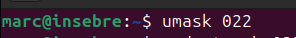
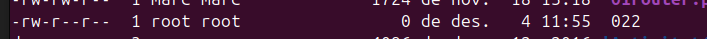

L'umask és una configuració en sistemes Unix/Linux que determina els permisos inicials per als fitxers i directoris nous que es creen. És com un "filtre" que restringeix els permisos predeterminats.

## Configurar Umask 

Quan es crea un fitxer o directori, el sistema assigna els permisos màxims possibles. Per als fitxers, els permisos predeterminats solen ser 666 (lectura i escriptura per a tothom), i per als directoris, els permisos predeterminats són 777 (lectura, escriptura i execució per a tothom). Aquests permisos es veuen modificats pel umask, que indica quins permisos s'han de retirar.

Suposem que el valor del umask és 022. Això significa el següent:

0 per al propietari (no es treuen permisos).
2 pel grup (s'elimina el permís d'escriptura).
2 per a altres (també se'ls elimina el permís d'escriptura).

**Càlcul del umask**:
Per entendre com es calculen els permisos finals, es resta el umask dels permisos predeterminats:

Permisos predeterminats:
Fitxers: 666
Directoris: 777
Restar el umask:

Si el umask és 022:
Fitxers: 666 - 022 = 644 (lectura i escriptura per al propietari, només lectura per al grup i altres).
Directoris: 777 - 022 = 755 (lectura, escriptura i execució per al propietari, i només lectura i execució per al grup i altres).

 Ara fare una prova amb la meva màquina.

Ara si creo un fitxer nou i miro els permisos tindra -rw-r--r--, que vol dir que el propietari te permisos de lectura i escritura el grup de lectura i altres també lectura.

## Aclaracions Umask 

- Cal aclarir que el **umask** es reinicia amb els permisos predeterminats al reiniciar la màquina.
- Si tanquem la sessió i obrim una altra també es reinicia als permisos predeterminats.
- Per establir un **umask** permanent, has de modificar els fitxers de configuració d'inici de la teva shell.