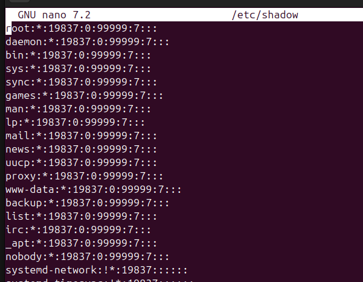

# Crear i eliminar usuaris a Ubuntu 

Tenim diferents formes de poder afegir i eliminar usuaris.

## ADDUSER

Adduser és la forma més sencilla de crear un usuari, ja que aquests alhora de crearlo ens proporciona les dades basiques per emplenar d'un usuari com la contrasenya, etc.

A més a més automaticament ens crea una propi directori de l'usuari creat ell com a admin.

Contrasenya

També ens demana el nom.

I més informació irrellebant.

## USERADD

Al contrari aquesta comanda no ens demana de proporcionar-li més informació apart del nom d'usuari, per tant tindrem que configurar nosaltres mateixos la contrasenya i altres paràmetres. Tampoc crea cap directori.

Per tant si volem assignar a un usuari la contrasenya amb aquesta comanda la podrem afegir manualment.

També és important que si no afegim -m al useradd no ens crea un directori home com he nombrat abans, per tant si volem crearlo amb el directori home utilitzarem useradd -m (nomusuari)

I podem comprovar que s'ha creat correctament l'usuari amb el directori home.

Si el creo sense -m no existeix el directori /home/josep.

## Eliminar usuari 

Aquest comanda ens facilita borrar un usuari, si anteriorment hem creat l'usuari amb una carpeta /home/nomusuari el deluser no ens borra aquesta carpeta.

Per eliminar la carpeta del propi usuari cal afegir el -r.

## Alguns dels fitxers de configuració

/etc/passwd

Conté la informació bàsica dels usuaris, com el nom d'usuari, l'ID d'usuari (UID), el grup principal (GID), el directori home i la shell per defecte.
Cada línia representa un usuari del sistema.

/etc/shadow

Emmagatzema les contrasenyes dels usuaris de manera xifrada, així com informació relacionada com la data de l'últim canvi de contrasenya, les dates d'expiració, etc.
Només els usuaris amb privilegis poden accedir a aquest arxiu.

/etc/group

Conté la informació sobre els grups del sistema, com el nom del grup, el GID i els usuaris que pertanyen a cada grup.
Cada línia representa un grup i els seus membres.

/etc/gshadow

Similar a /etc/shadow, però per als grups. Guarda informació sensible com les contrasenyes dels grups (si s'utilitzen) i els administradors de cada grup.

/etc/skel/

És un directori que conté els arxius per defecte que es copien al directori home d'un nou usuari quan es crea un compte.
Per defecte és buit.

